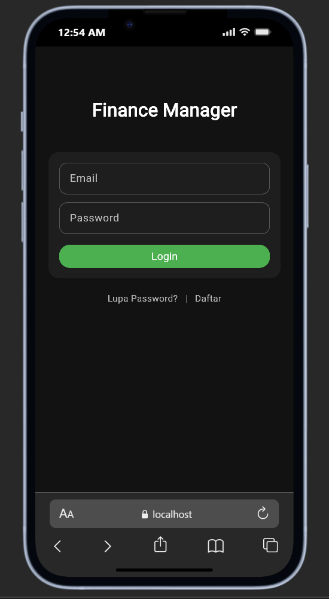
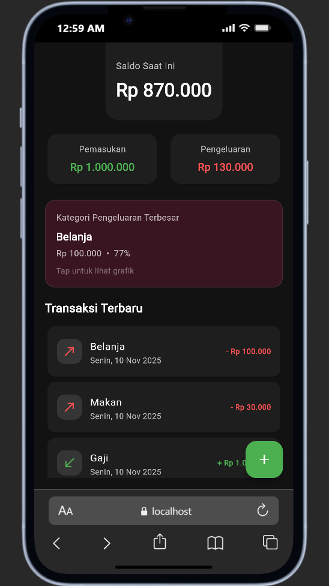
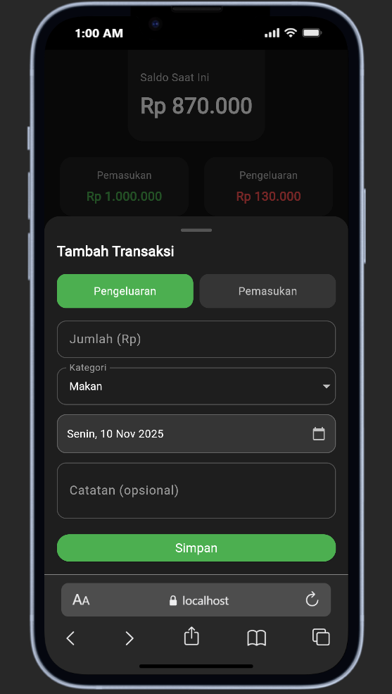
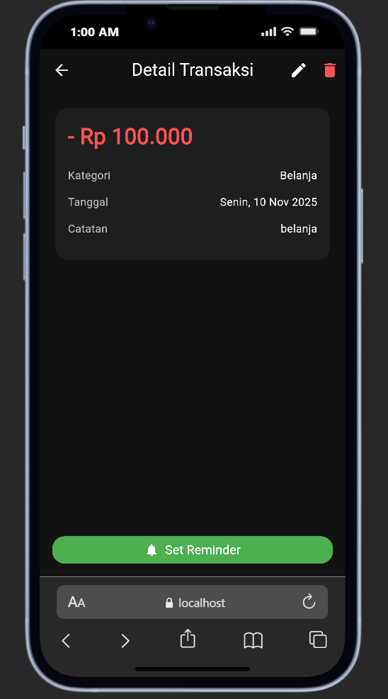
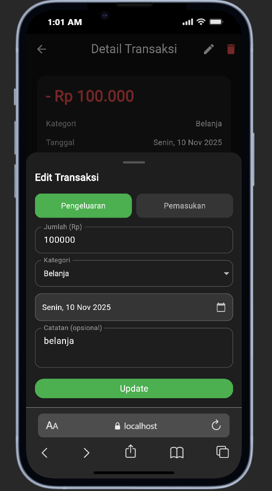
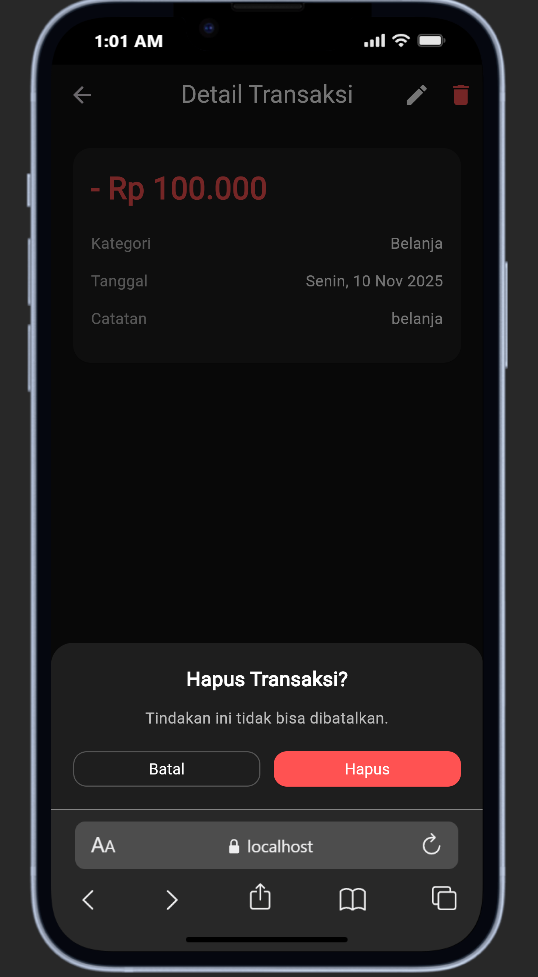
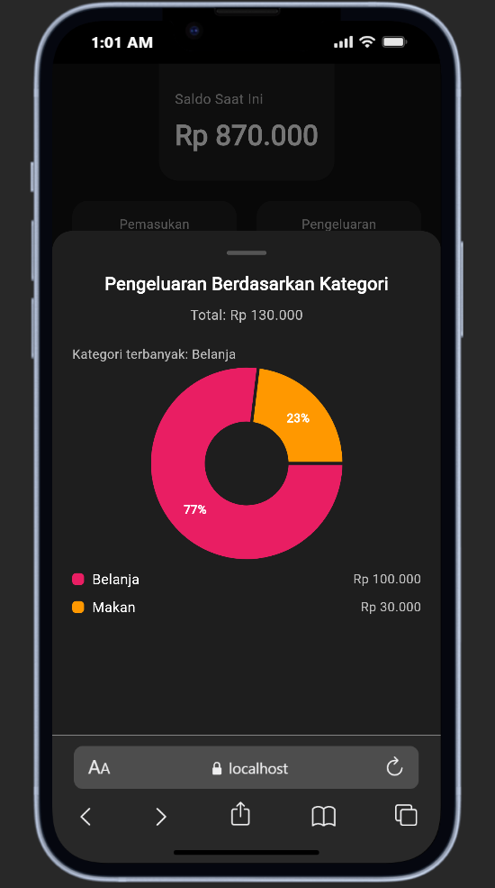

# uts_pab_nabel

📌 Aplikasi Manajemen Keuangan – Flutter

Aplikasi ini bertema manajemen keuangan pribadi. Fokusnya membantu pengguna mencatat pemasukan dan pengeluaran harian secara cepat, memantau saldo, dan melihat analisis sederhana dalam bentuk grafik.

Aplikasi dibuat menggunakan Flutter dengan pendekatan UI/UX mobile-first dan tampilan dark mode.

🎯 Tujuan Aplikasi

Mempermudah pencatatan transaksi harian (pemasukan dan pengeluaran).

Menampilkan saldo terkini secara otomatis.

Menyajikan ringkasan visual agar pengguna memahami pola pengeluaran.

✨ Fitur Utama
Fitur	Keterangan
Login	Halaman login untuk masuk ke aplikasi (UI saja, tanpa backend).
Dashboard	Menampilkan saldo, total pemasukan, total pengeluaran, dan daftar transaksi terbaru.
Tambah Transaksi	Tambah pemasukan atau pengeluaran melalui bottom sheet.
Edit & Hapus Transaksi	Pengguna dapat memperbarui atau menghapus transaksi dari halaman detail.
Detail Transaksi	Menampilkan informasi lengkap transaksi termasuk kategori, tanggal, dan nominal.
Analisis Pengeluaran (Grafik)	Pie chart untuk melihat persentase pengeluaran per kategori, ditampilkan melalui bottom sheet.
Preview Kategori Terbesar	Dashboard menampilkan kategori pengeluaran terbesar sebagai ringkasan cepat.
🎨 Tampilan & UX

Dark Theme untuk kenyamanan visual.

Komponen UI menggunakan card dengan sudut membulat (rounded).

Navigasi sederhana dan mudah dipahami pengguna.

Pie chart interaktif untuk analisis pengeluaran.

🖼️ Screenshot UI

Login

Dashboard

Bottom Sheet – Tambah Transaksi

Detail Transaksi

Edit Transaksi

Hapus Transaksi

Analisis Pengeluaran (Pie Chart)

🧱 Teknologi & Library

Flutter & Dart

fl_chart → untuk grafik pie chart

Struktur kode dipisah menjadi page, widgets, dan models agar mudah dikembangkan.
